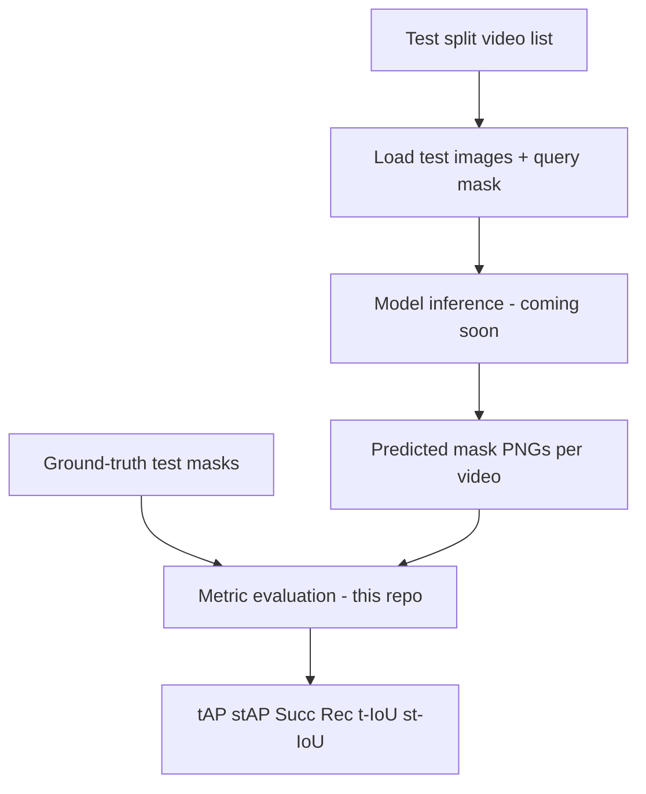

# Towards Visual Query Segmentation in the Wild

This repository contains the **official evaluation code** for the paper *Towards Visual Query Segmentation in the Wild* and the VQS (Visual Query Segmentation) benchmark.

**Dataset:** [vqsresearcher/vqsdataset](https://github.com/vqsresearcher/vqsdataset)

It computes the metrics reported in the paper:

- **tAP** / **tAP50** / **tAP75** — Temporal Average Precision
- **stAP** / **stAP50** / **stAP75** — Spatio-Temporal Average Precision
- **Succ** — Success rate
- **Rec** — Recovery (% of accurately tracked GT frames)
- **t-IoU** / **st-IoU** — Mean temporal and spatio-temporal IoU

> **Model code (coming soon):** inference and training code for our method is **not included yet**. Model weights and inference scripts will be added to this repository **soon**.

What is included here:

1. Metric implementation (`metrics/`)
2. Evaluation scripts (`metrics/scripts/run_metrics.sh`)
3. Documentation of the full test pipeline (dataset → inference → metrics)

---

## Repository layout

```
├── README.md
├── requirements.txt
├── metrics/
│   ├── calculate_mask_metrics_simple.py   # main evaluation CLI
│   ├── calculate_mask_metrics.py
│   ├── mask_loader.py
│   ├── mask_metrics.py
│   ├── METRICS.md                         # metric definitions
│   ├── evaluation/structures.py
│   ├── metrics/                           # VQ2D-style metric library
│   └── scripts/run_metrics.sh
├── pipeline/examples/
│   └── run_metrics_example.sh             # example evaluation command
└── splits/
    └── README.md                          # train/test split notes
```

---

## Full test pipeline (dataset → inference → metrics)



Evaluation in this repo covers the last step only. Steps 1–3 are described below so you can reproduce numbers once predictions are available.

---

## Step 1 — Test inputs

### Dataset layout

Each video is a folder of frame-wise images and binary masks:

```
dataset/
├── images/
│   └── {video_id}/
│       ├── 00000.jpg    # visual query frame (conditioning input)
│       ├── 00001.jpg
│       ├── 00002.jpg
│       └── ...
└── masks/
    └── {video_id}/
        ├── 00000.png    # query mask (model input; excluded from metrics)
        ├── 00001.png    # GT mask for frame 1 (only where target is visible)
        ├── 00002.png
        └── ...
```

- **Video ID format:** `{category}-{object}-set_{N}` (e.g. `human-basketball_player-set_2`).
- **Frame naming:** zero-padded 5-digit index (`00001.png`, not `1.png`).
- **Missing frames:** if the target is absent in a frame, no mask file is stored for that frame.
- **Query frames:** `00000` (visual query) and `99999` (if present) are excluded automatically during metric computation.

### Test split

Metrics should be computed on the **official test list**, not on the full dataset.

Provide a text file with one `video_id` per line, for example:

```
human-basketball_player-set_2
vehicle-car-set_10
...
```

Download official split files from the [dataset repository](https://github.com/vqsresearcher/vqsdataset) (see `splits/README.md`). Always evaluate with the same split, GT folder, and prediction folder that were used when reporting a result.

### Ground-truth folder for evaluation

Use the GT mask folder that matches your experimental setup. For our main result we evaluate against a filtered GT set aligned with the training data, not the raw release folder alone. When comparing to our numbers, use the same GT path and test list.

---

## Step 2 — Model inference (coming soon)

Our method takes the **test split** as input and writes **predicted binary masks** in the same folder layout as GT.

### Inputs required per video

| Input | Path | Role |
|---|---|---|
| Frame images | `images/{video_id}/*.jpg` | Full video frames |
| Query image | `images/{video_id}/00000.jpg` | Visual query (what to segment) |
| Query mask | `masks/{video_id}/00000.png` | Spatial prompt on the query frame |
| Video list | `test_t-IoU.txt` | Which videos to run |

### Inference procedure (conceptual)

Our inference follows a **segment-wise visual query segmentation** protocol:

1. **Read the test list**  
   Process only videos listed in the official test split file.

2. **Condition on the visual query**  
   For each video, frame `00000` and its mask `00000.png` define the target object. This pair is the fixed conditioning input for the whole video.

3. **Segment the remaining frames**  
   Frames after `00000` are processed in consecutive segments (in our experiments, 16 frames per segment: 1 query frame + 15 video frames). The model propagates the query appearance through each segment.

4. **Merge segment outputs**  
   Predictions from all segments are combined into one mask sequence per video.

5. **Write predictions**  
   Save one binary PNG per predicted frame:

   ```
   predicted_masks/
   └── {video_id}/
       ├── 00001.png
       ├── 00002.png
       └── ...
   ```

   Predictions must use the same frame indices and naming convention as the GT masks. Do **not** include `00000.png` in the prediction folder unless your method explicitly predicts it; metric code skips query frames regardless.

### Expected prediction properties

- **Format:** single-channel PNG, background = 0, foreground > 0 (typically 255).
- **Resolution:** should match GT; mismatched sizes are resized to GT during evaluation.
- **Coverage:** predict masks on frames where your model detects the target. Missing prediction frames count as failures in temporal / recovery metrics.
- **One method folder:** one top-level directory with one subfolder per evaluated video.

### Hardware (for reference)

Inference in our experiments uses CUDA GPUs with a SAM2-based architecture. Exact configs, checkpoints, and scripts will be released **soon** in this repository.

---

## Step 3 — Compute metrics (this repo)

Once you have `predicted_masks/` and the matching GT folder, run:

```bash
pip install -r requirements.txt

bash metrics/scripts/run_metrics.sh \
  --gt-folder /path/to/gt/masks \
  --pred-folder /path/to/predicted_masks \
  --video-list /path/to/test_t-IoU.txt \
  --output results.json
```

Or call the Python CLI directly:

```bash
cd metrics

python calculate_mask_metrics_simple.py \
  --gt_folder /path/to/gt/masks \
  --pred_folder /path/to/predicted_masks \
  --output results.json \
  --verbose
```

When using a video list, `run_metrics.sh` symlinks only listed videos into a temporary folder before evaluation (same behavior as the internal `run_*.sh` scripts in the parent project).

### Example (our method, internal paths)

```bash
bash metrics/scripts/run_metrics.sh \
  --gt-folder /path/to/masks_filtered_0.0007_Feb15 \
  --pred-folder /path/to/test_outputs_2stage_DAM_AdaptiveGate_Jan28 \
  --video-list /path/to/final_mixture_exchange100_Jan3/test_t-IoU.txt \
  --output results/proposal_DAM_AdaptiveGate_Quality_nf8_0.0007_Feb15.json
```

See `pipeline/examples/run_metrics_example.sh` for a template.

---

## Metrics output

Mapping to paper-style names:

| Paper name | Script output key | Notes |
|---|---|---|
| tAP | `Temporal AP @ IoU=0.25` | also reported at 0.50 / 0.75 / 0.95 |
| tAP50 | `Temporal AP @ IoU=0.50` | fraction in [0, 1] |
| tAP75 | `Temporal AP @ IoU=0.75` | |
| stAP | `SpatioTemporal AP @ IoU=0.25` | |
| stAP50 | `SpatioTemporal AP @ IoU=0.50` | |
| stAP75 | `SpatioTemporal AP @ IoU=0.75` | |
| Succ | `Success @ IoU=0.05/0.10/0.20` | percentage in [0, 100] |
| Rec | `Tracking % recovery @ IoU=0.50/0.75/0.95` | percentage in [0, 100] |
| t-IoU | `t-IoU` | mean over videos, [0, 1] |
| st-IoU | `st-IoU` | mean over videos, [0, 1] |

Full definitions and formulas: `metrics/METRICS.md`.

---

## Important evaluation notes

1. **Use the same split, GT, and predictions.** Different GT folders or test lists produce different numbers. Always report which split file and GT folder were used.

2. **Top-1 evaluation.** With one prediction track per video, tAP/stAP reduce to the fraction of videos whose t-IoU / st-IoU exceeds each threshold.

3. **Recovery denominator.** `Tracking % recovery` counts accurate frames over **common GT–prediction frames** (frames present in both). See `metrics/METRICS.md` for details.

4. **Query frames excluded.** `00000.png` and `99999.png` are never scored.

---

## Installation

```bash
pip install -r requirements.txt
chmod +x metrics/scripts/run_metrics.sh pipeline/examples/run_metrics_example.sh
```

Dependencies: `numpy`, `opencv-python`, `pandas`.

---

## Citation

If you use this evaluation code or the VQS dataset, please cite our paper (bibtex to be added upon publication).
